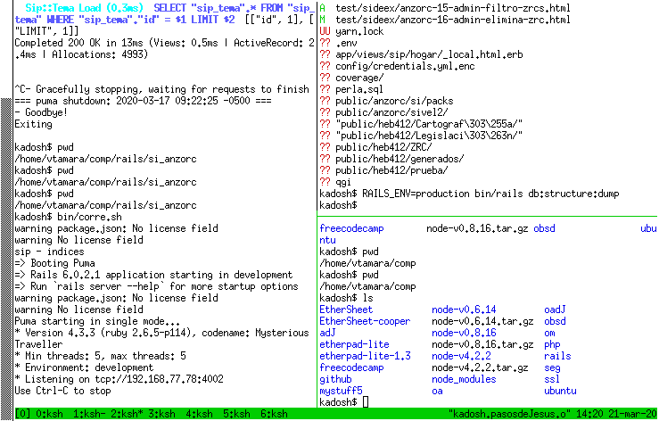

## Conceptos básicos {#conceptos_basicos}

Los conceptos y herramientas presentados desde esta sección se asimilan mejor
practicando.
Procure ejercitarlos desde un interprete de órdenes, bien operando
directamente un sistema adJ o bien ingresando remotamente desde otro
sistema como se explica en [xref](#primer_uso_de_adJ).

### Definiciones iniciales {#definiciones_iniciales}

Un *archivo* es información delimitada y con atributos que ayudan a
identificarla como nombre, fecha de creación y ubicación. Se ubica en alguna
ruta o sitio del sistema de archivos.

Un *programa* es un archivo con instrucciones que pueden ser efectuadas
por el computador.  La secuencia de instrucciones determina lo que hará el
programa.  El *formato de un archivo* es la manera como está organizada la
información para que pueda ser empleada con facilidad por el  o los programas
que pueden leer o escribir. 
Por ejemplo un archivo de nombre `carta.odt` posiblemente
se trate de una carta escrita en formato de Open Document Format
(lo sugieren las últimas letras `.odt`).
Para verla o modificarla debe usarse un programa que entienda ese formato, 
uno entre otros es LibreOffice.

### Intérprete de órdenes {#interprete_de_ordenes}

El intérprete de órdenes le permite usar varias órdenes internas, así
como ejecutar programas.
Es común que las órdenes o programas requieran algo de información como
suministro (i.e parámetros o argumentos), así como opciones que modifiquen
el comportamiento predeterminado.
Tal información suele darse a continuación del nombre de la orden, separando
un parámetro o una opción de otra con espacios. Si es una de las primeras veces
que ingresa al sistema, recomendamos las siguientes órdenes:

**man man**

:   El programa **man** permite ver un tema del manual del sistema. Puede
recibir como parámetro el tema sobre el cual desea ver la documentación.
Así que **man man** presenta la documentación de la orden **man**.
Entre los temas posibles puede emplear el nombre de un programa instalado o
de una función de la librería del sistema. 
Notará que `man` por omisión ingresa a un paginador (llamado `less`) que le 
permite desplazarse hacia arriba y hacia abajo con las flechas y salir con 
la letra `q`.

**passwd**

: Permite cambiar su clave en el sistema. Por favor escoja una buena clave
que no aparezca en diccionario de idioma alguno, preferiblemente que tenga
mayúsculas y minúsculas, así como números y/o caracteres de puntuación.
Sugerimos las claves generadas con programas especializados como **apg**.
Tenga en cuenta que si su clave llega a ser descubierta por un tercero,
él/ella podría actuar a nombre suyo.

Para comprender el uso de parámetros y opciones, intente también:

* `man passwd` ejecutará la orden `man` con parámetro `passwd`. Así
  verá el manual de la orden `passwd` en el paginador.
* `man -c passwd` ejecutará la orden `man` con opción `-c` y 
  parámetro `passwd`, con lo cual verá el manual de la orden `passwd` pero
  sin paginador --el manual completo se presentará en pantalla pero no
  alcanzará a ver el comienzo por la cantidad de información, ni podrá usar 
  flechas para navegar sobre el documento, sino que regresará a la línea 
  de órdenes.

Después revise en detalle el manual de la orden `man` e intente con otros
parámetros y opciones.

### Sistema de Archivos

En Unix la información se organiza en archivos dentro de directorios del
sistema de archivos.  El directorio inicial o raíz se denota por `/`, los
nombres de archivos o directorios pueden especificarse indicando la ruta
completa desde la raíz, por ejemplo el archivo `/usr/bin/awk` está en el
directorio de nombre `bin` que a su vez está en un directorio de nombre
`usr` el cual es un subdirectorio del directorio raíz `/`.
Cada usuario del sistema tiene además de su login y clave, un directorio que
llamamos *directorio personal* cuya ruta normalmente es de la forma
`/home/juan`.


El intérprete de órdenes que emplee tendrá como parte de su estado un
directorio de trabajo, un símbolo de espera de órdenes y variables de entorno.
La manera de ver y alterar estos datos depende del intérprete de órdenes que
emplee, nos limitaremos al intérprete de órdenes **ksh** (que tiene bastantes
cosas en común con otros intérpretes de órdenes como **bash** y **zsh**).

Podrá examinar el directorio de trabajo con `pwd`, listar algunas
variables de entorno (las exportadas) con **export** y modificar el
símbolo de espera de órdenes con la variable de entorno `PS1`.
A continuación se listan algunas órdenes/programas relacionados con el
sistema de archivos y un mínimo del uso de cada uno. Sugerimos que mire la
documentación que corresponde a cada uno (e.g para ver documentación del
programa **ls** ejecute desde un intérprete de órdenes **man ls**):

`pwd`

: Muestra directorio de trabajo.

`ls`

: Muestra listado de archivos y directorios. Sin parámetros muestra los del
directorio de trabajo. Como parámetro puede indicarse la ruta del directorio
del cual se desea ver el contenido y con la opción `-l` presenta atributos
adicionales de cada archivo (por ejemplo los directorios inician con `d`
mientras que los archivos con `-`.  También puede dar como parámetro
una ruta por listar (si no da una se lista el directorio de trabajo).

`mkdir public_html`

: Permite crear un directorio (en este caso `public_html`), si no se
especifica la ruta completa **mkdir** lo crea en el directorio de trabajo.

`cd public_html`

: Para cambiarse a otro directorio (en este caso al directorio `public_html`
que es subdirectorio del directorio de trabajo). Sin parámetros, `cd`
cambia al directorio personal.

`cp traido/index.htm public_html/index.html`

: El programa `cp` permite copiar uno o más archivos. En el ejemplo
presentado el archivo `index.htm` del subdirectorio `traido` es copiado
en el subdirectorio `public_html` con el nombre index.html. Note que ambos
subdirectorios son subdirectorios del directorio  de trabajo y que debe
existir el archivo `traido/index.htm`. Pueden copiarse también directorios
junto con subdirectorios usando la opción `-r`, por ejemplo:
```
    cp -r traido/* public_html/
```
que copia todos los archivos y subdirectorios del directorio traido de manera recursiva al
directorio `public_html`.

`rm traido/index.htm`

: Que elimina el archivo `traido/index.html`. Pueden eliminarse
directorios con todo su contenido de forma recursiva con la opción
`-rf` del programa `rm`.

`mv traido/juan.htm traido/pedro.html`

: El programa `mv` moverá (o en este caso renombra) el archivo
`traido/juan.htm a traido/pedro.html`.

### tmux

Para operar desde la terminal con más versatilidad es muy útil `tmux`
que introduce conceptos de sesiones, ventanas y paneles que permiten operar
muy efectivamente.

* Las sesiones le permiten retomar el trabajo que estaba haciendo
  previamente.
* Las ventanas permiten operar en varios interpretes de órdenes que ocupan
  el espacio completo donde visualiza la terminal.
* Los paneles dividien una ventana en más áreas para ver simultaneamente
  varios interpretes de órdenes.

Puede probar el uso de sesiones de esta forma:

1. Abra una terminal e inice tmux con `tmux`
2. Escriba por ejemplo `echo Hola mundo` y pulse Enter, que debe imprimir en pantalla Hola Mundo
3. Cierre la terminal  --por la forma de operación de tmux esto no terminará la sesión que inició
4. Abra otra terminal e inice tmux pero indicando que se una a una sesión existente con `tmux -a`.  Debería poder ver su sesión de terminal con Hola Mundo.

Ya en tmux, puede enviar órdenes a tmux comenzando con la secuencia de teclas
Control-b, por ejemplo  para crear una ventana emplee Control-b y después
la letra `c` (minúscula).


Notará en la parte inferior izquierda indicadores de 2 ventanas
abiertas (una con `[0]` y la otra con `[1]`).
Pase a la segunda ventana (con índice 1) con Control-b 1 y a la primera
con Control-b 0.


Para dividir una ventana (o un panel) en 2 paneles separados por una línea
vertical en la mitad use `Control-b %` y para dividir en 2 con una línea
horizontal use `Control-b "`.  Pase al panel de la derecha con
`Control-b →`, pase al panel de la izquierda con `Control-b ←`,
al de arriba con `Control-b ↑` y al de abajo con `Control-b ↓`



Puede cambiar el orden de una panel mediatne Control-b { y Control-b }.
Puede convertir un panel en una nueva venta con Control-b !


### Lecturas recomendadas {#lecturas_recomendadas_conceptos_basicos}

Páginas `man` de las órdenes /programas introducidos en este capítulo.
Se han tomado porciones de la sección "telnet y ssh" de [AALinux](#bibliografia)


